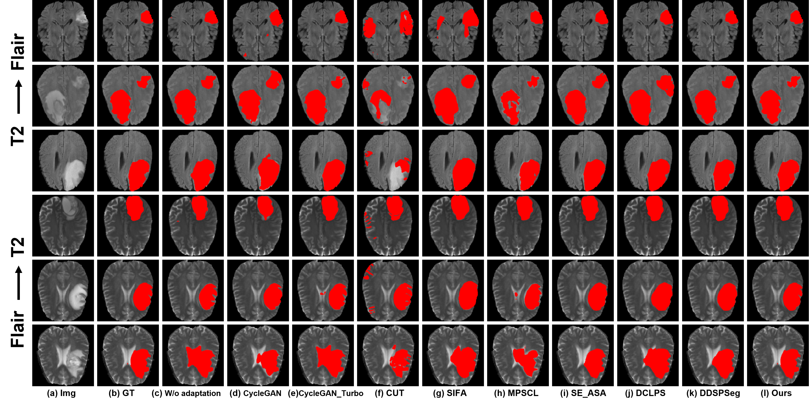
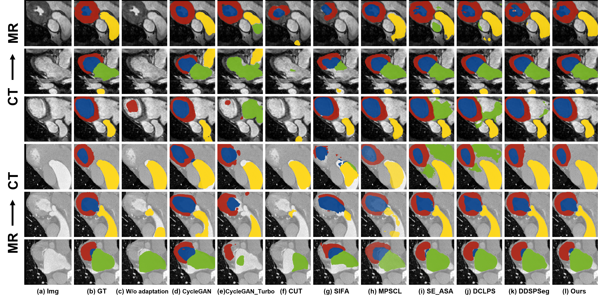
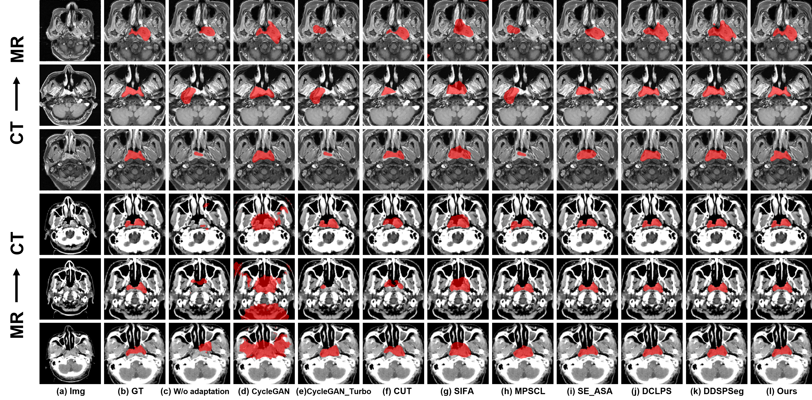

# RDEA — Public Interface Release

## Release status

This is a limited public release prepared for peer review. It documents the interfaces used by the segmentation pipeline and provides a dependency-free contract test. The core implementation is withheld prior to acceptance.

**Full source code coming soon:** the complete source code will be released after the paper is accepted.

## What is included

- Typed request/response objects for segmentation inference.
- Model, dataset, pipeline, and evaluator interface contracts.
- Domain-selection and artifact-loading entry points at the interface level.
- A dependency-free interface demo and contract tests.

The omitted components are not reconstructible from this package alone. The public files expose only the boundary between the private implementation and its callers.

## Public interface

The public contract describes the following high-level flow:

```text
SegmentationRequest
        |
        v
PrivateCoreAdapter.set_domain() -> load_weights() -> predict()
        |
        v
SegmentationResponse -> EvaluatorInterface.evaluate()
```

The contract is defined in [`src/rdea_public/interfaces.py`](src/rdea_public/interfaces.py). It specifies input shape, domain labels, optional metadata, output shape, and lifecycle methods without exposing the internal computation.

## Interface-only demonstration

The demonstration stops at the private implementation boundary:

```text
python examples/interface_demo.py
```

The contract tests can be run with:

```text
python -m unittest discover -s tests -v
```

No model weights, medical images, or private runtime dependencies are required for these checks.

## Repository layout

```text
src/rdea_public/interfaces.py       # public data and protocol contracts
src/rdea_public/stubs.py            # intentionally unavailable core adapter
examples/interface_demo.py          # schema/lifecycle demonstration only
tests/test_contract.py              # interface tests only
configs/public_interface.json       # redacted schema example
docs/INTERFACE_SCOPE.md             # disclosure boundary
docs/figures/                       # selected qualitative comparison figures
```

## Qualitative comparisons

The following images are selected qualitative comparison figures from the supplied paper-figure set.

### Brain qualitative comparison



### Heart qualitative comparison



### Nasopharyngeal carcinoma qualitative comparison



The supplied figure directory contains image artifacts rather than source tables or machine-readable result files. No numerical values have been reconstructed from the figures, and no raw result-generation code is included in this interface release.

## Disclosure statement

This repository defines the public software boundary available during peer review. The interface package, qualitative comparison figures, and contract tests are released separately from the private implementation. The complete implementation, training details, and reproducibility materials are planned for release after acceptance.
