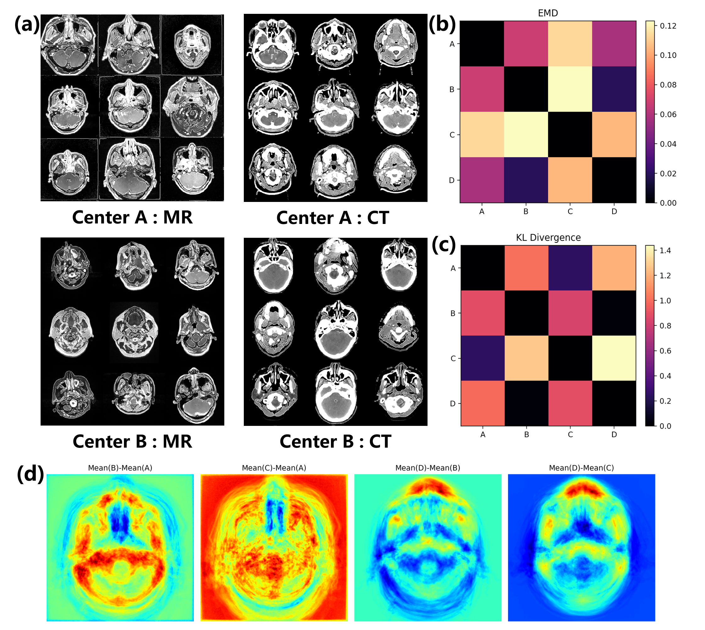
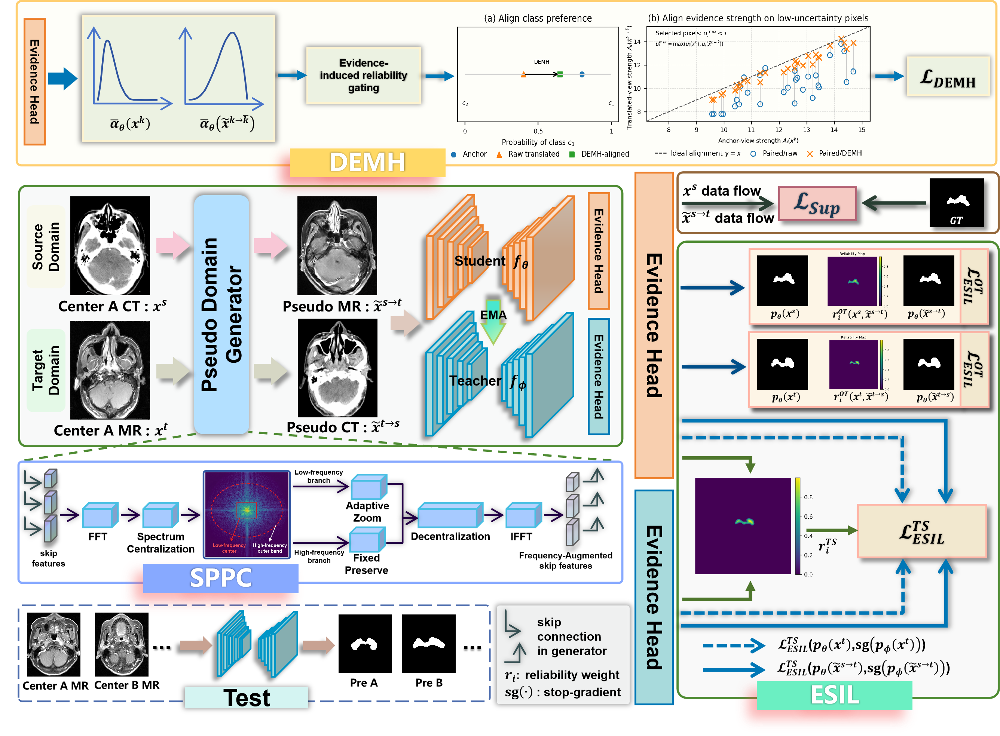
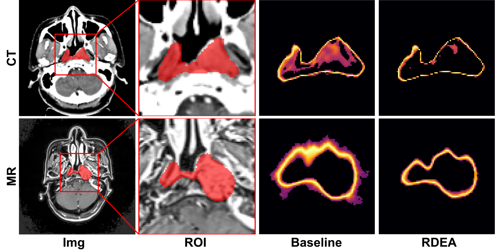
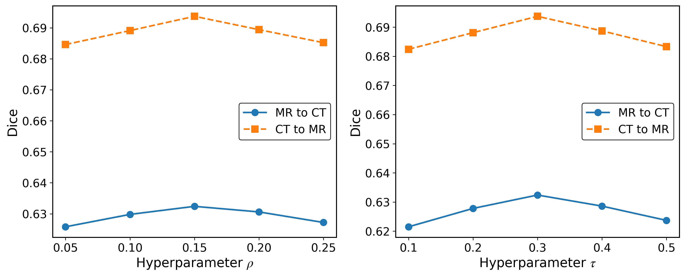

# RDEA — Public Interface Release

> **Reviewer-facing interface package.** This repository intentionally does not contain the private model implementation, training pipeline, checkpoints, or data needed to reproduce the reported experiments.

## Release status

This is a limited public release prepared for peer review. It documents the interfaces used by the segmentation pipeline and provides a dependency-free contract test. The core implementation is intentionally withheld to protect the work before acceptance.

**Full source code coming soon:** the complete source code will be released after the paper is accepted.

The public package is therefore **not an executable reproduction of the paper results**. The interface demo only validates the expected call structure and data contract; it does not perform segmentation or recreate the reported metrics.

## What is included

- Typed request/response objects for segmentation inference.
- Model, dataset, pipeline, and evaluator interface contracts.
- Domain-selection and artifact-loading entry points at the interface level.
- A private-core adapter stub that deliberately raises `NotImplementedError`.
- A dependency-free interface demo and contract tests.
- Selected figures from the paper for qualitative and experimental-result context.

## What is intentionally withheld

- The core network architecture and custom modules.
- Training, validation, loss, uncertainty, and post-processing implementations.
- Private datasets, annotations, raw predictions, checkpoints, and weights.
- Exact internal preprocessing details and sensitive hyperparameter combinations.
- Machine-specific paths, logs, private dependencies, and experiment scripts.

The omitted components are not reconstructible from this package alone. The public files expose only the boundary between the private implementation and its callers.

## Public interface

The public contract describes the following high-level flow:

```text
SegmentationRequest
        |
        v
PrivateCoreAdapter.set_domain() -> load_weights() -> predict()
        |
        v
SegmentationResponse -> EvaluatorInterface.evaluate()
```

The contract is defined in [`src/rdea_public/interfaces.py`](src/rdea_public/interfaces.py). It specifies input shape, domain labels, optional metadata, output shape, and the lifecycle methods without exposing the internal computation.

## Interface-only demonstration

The demonstration intentionally stops at the private implementation boundary:

```text
python examples/interface_demo.py
```

Run the contract tests with:

```text
python -m unittest discover -s tests -v
```

No model weights, medical images, or private runtime dependencies are required for these checks.

## Repository layout

```text
src/rdea_public/interfaces.py       # public data and protocol contracts
src/rdea_public/stubs.py            # intentionally unavailable core adapter
examples/interface_demo.py          # schema/lifecycle demonstration only
tests/test_contract.py              # interface tests only
configs/public_interface.json       # redacted schema example
docs/INTERFACE_SCOPE.md             # disclosure boundary
docs/figures/                       # selected paper figures
```

## Paper figures and experimental context

The following images are copied from the supplied paper-figure set. They are included as documentation and visual evidence only; the scripts and private artifacts used to generate them are not distributed here.

### Task context



### Method overview



### Qualitative comparisons


### Ablation and sensitivity studies





The supplied figure directory contains image artifacts rather than source tables or machine-readable result files. No numerical values have been reconstructed from pixels, and no raw result-generation code is included in this interface release.

## Disclosure statement

This repository is provided to make the public software boundary clear to reviewers while protecting the unpublished implementation. Please do not interpret the presence of the interface names or figures as a release of the underlying method. The complete implementation, training details, and reproducibility materials will be provided after acceptance.
